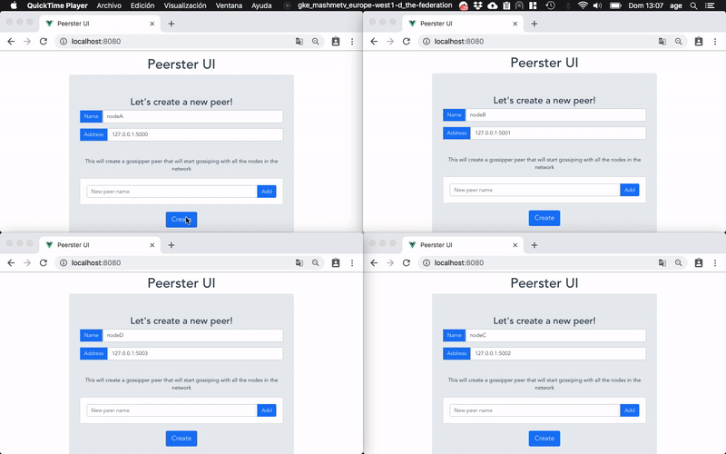
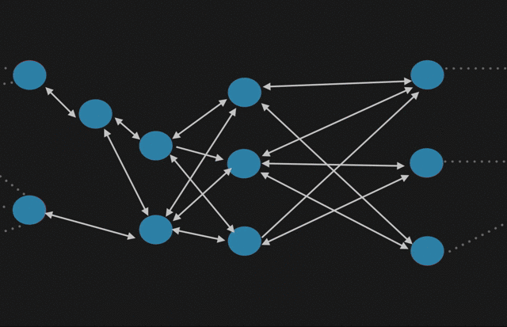
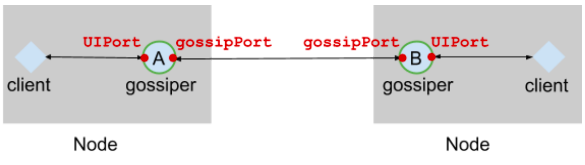

# Peerster
Peerster is a project fully written in `Go` that aims to create a full enviroment to emulate a distributed network using the Gossip Protocol.

Peerster is part of the practical projects from the subject [Decentralized Systems Engineering](http://edu.epfl.ch/coursebook/en/decentralized-systems-engineering-CS-438)

## Gossiping in Peerster

Gossip protocols are distributed exchange protocols for robust information exchange​,
typically deployed on dynamic network topologies​, e.g, because nodes can join and leave
the network, they are mobile, their connectivity varies, etc. Examples of applications are
ad-hoc communication between self-driving cars, peer-to-peer networks that broadcast a TV
program, sensor nodes that detect fire hazard in remote areas. The way gossip protocols
spread information resembles gossipping in real life: a rumor may be heard by many people,
although they don’t hear it directly from the rumor initiator. The figure below depicts a gossip
protocol.

(source: [introduction-to-gossip](https://managementfromscratch.wordpress.com/2016/04/01/introduction-to-gossip/))

When a node joins a gossip protocol, it has the contact information (e.g., network address)
of a few nodes it can send messages to. For instance, node C in the figure above knows the
addresses of nodes E and F. Additionally, when a node receives a message, it learns the
address of the sender. As an example, node C learns the address of node A when it
receives the message from A.

## Peerster Design
Each node in Peerster acts as a gossiper​, as depicted above, but also exposes an API to
clients to allow them to send messages, list received messages etc. The client could, in
principle, run either locally, on the same machine, or remotely.The gossiper communicates 
with other peers on the gossipPort, and with clients on the UIPort. 
Below you can find the high-level design:

(source: [Decentralized Systems Engineering docs](http://edu.epfl.ch/coursebook/en/decentralized-systems-engineering-CS-438))

## TODOs

+ Create logger for each gossiper
+ Create separate entropyTimer handler
+ Document CLI/Web interface
+ More documentation
